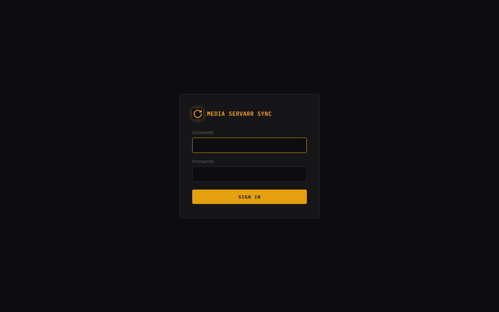
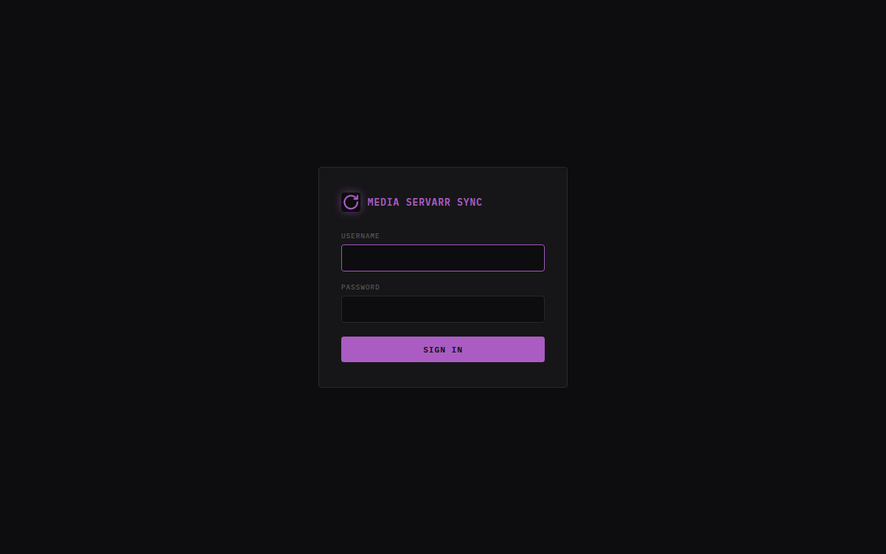
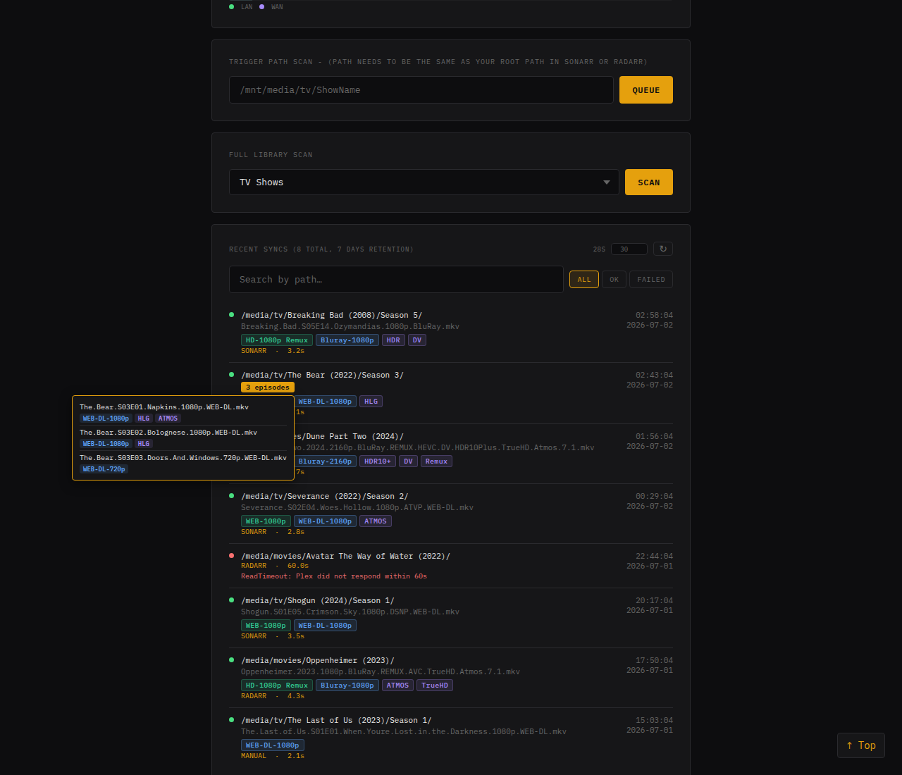
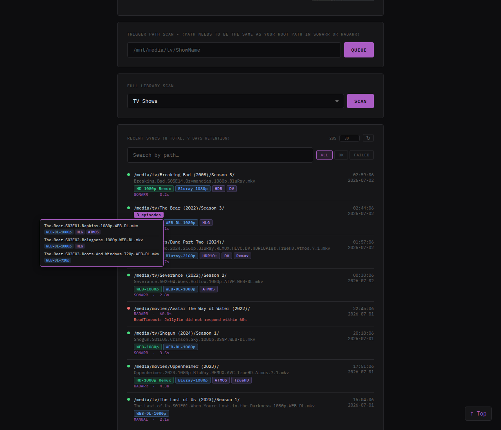
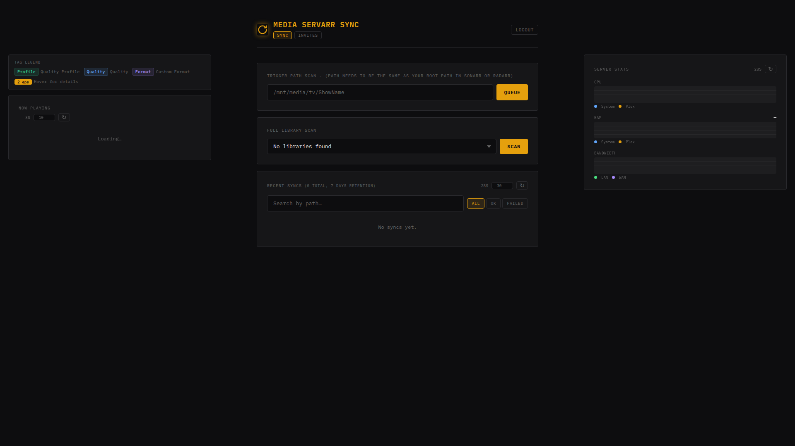
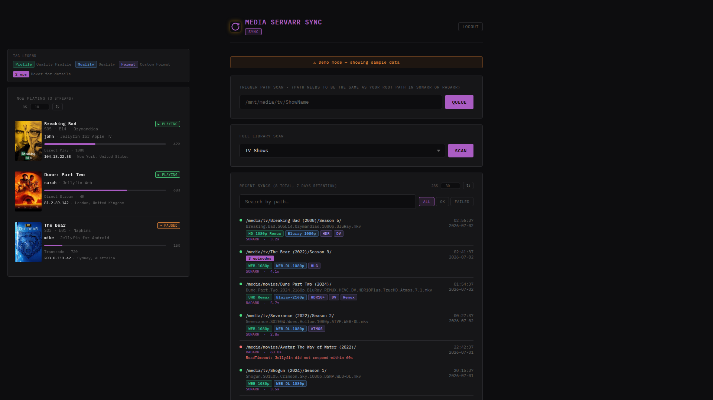
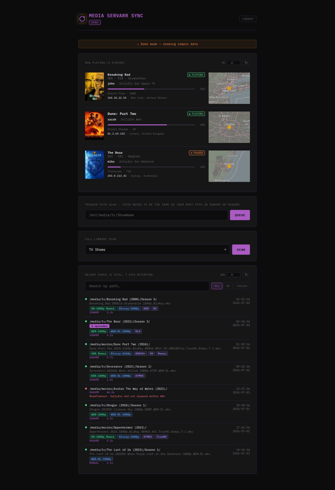
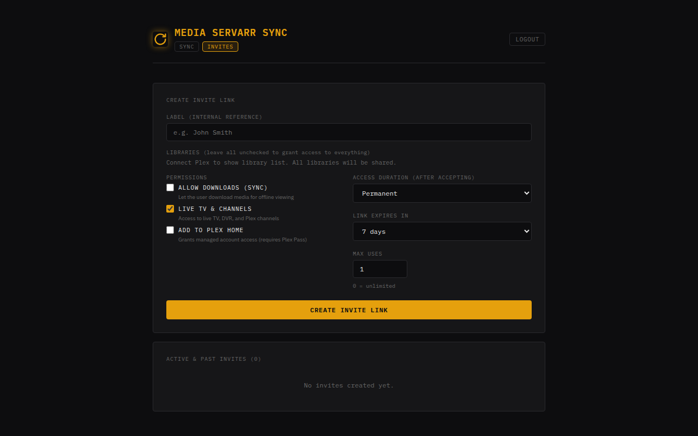

<p align="center">
  
</p>

# Media Servarr Sync

<p align="center">
  <a href="https://github.com/JohnFawkes/Media-Servarr-Sync/stargazers"></a>
  <a href="https://github.com/JohnFawkes/Media-Servarr-Sync/releases/latest"></a>
  <a href="https://github.com/JohnFawkes/Media-Servarr-Sync/pkgs/container/media-servarr-sync"></a>
  <a href="https://github.com/JohnFawkes/Media-Servarr-Sync/blob/master/LICENSE"></a>
</p>

> ⚠️ **AI-Generated Project** — This project was built with the assistance of [Claude AI](https://claude.ai) by Anthropic. Review all code before running it in your environment.

A lightweight webhook receiver that listens for **Sonarr** and **Radarr** events and triggers a targeted **partial library scan** on **Plex** and/or **Jellyfin** — no full library refreshes needed. Optionally integrates with **rclone VFS** to clear the cache before scanning (enable only if you use an rclone mount).

```
Sonarr / Radarr  →  media-servarr-sync  →  [rclone vfs/forget + vfs/refresh]  →  Plex and/or Jellyfin partial scan
                                                  (optional, USE_RCLONE=true)
```

Plex and Jellyfin support are each independently toggled with `PLEX_ENABLED` / `JELLYFIN_ENABLED` (Plex is on by default for backward compatibility). Enable one or both — a path is scanned on every enabled server that has a matching entry in its `SECTION_MAPPING` / `JELLYFIN_SECTION_MAPPING`.

---

## Features

- **Plex and/or Jellyfin** — enable either or both with `PLEX_ENABLED` / `JELLYFIN_ENABLED`. A path is scanned on every enabled server whose section mapping matches it
- **Targeted scans** — only the affected show/movie folder is scanned, not the whole library (Plex `library.update(path=...)`; Jellyfin `/Library/Media/Updated`)
- **rclone optional** — works standalone without rclone; enable with `USE_RCLONE=true` if you use a VFS mount
- **Deduplication** — duplicate webhooks for the same folder are dropped while a sync is already in-flight
- **Configurable delay** — wait N seconds after the webhook before scanning (gives Sonarr/Radarr time to finish writing)
- **Minimum file age** — optionally hold off scanning until a file is at least N seconds old
- **Retry on timeout** — Plex scan attempts retry up to 3 times with automatic reconnection on stale sessions
- **Health endpoint** — `/health` exposes queue depth, Plex/Jellyfin connectivity, rclone mode, and recent sync history
- **Stats API** — `/api/stats` returns aggregate sync counts, queue state, and last sync info — ready for [Homepage](https://gethomepage.dev) `customapi` widget
- **Manual trigger UI** — password-protected web UI at `/` for ad-hoc scans
- **Themed UI** — the amber Plex accent switches to Jellyfin purple automatically when only Jellyfin is enabled; with both enabled, a toggle in the header lets you pick per-browser (saved in `localStorage`)
- **Sync history** — paginated sync results (path, status, duration, errors) with server-side path search and status filter (All / OK / Failed)
- **Episode display** — for Sonarr events, the episode filename (e.g. `Show.S01E01.mkv`) is shown beneath the season folder path; batch imports show an episode-count badge that reveals all individual filenames on hover (filenames wrap fully, no truncation)
- **Quality & profile tags** — each history entry displays colour-coded tags for the file quality (blue), quality profile (green, resolved via the Sonarr/Radarr API), and any custom formats (purple); hover a tag to see its label
- **Filterable tags** — click any quality or profile tag to filter the history list to matching entries; active filters appear as dismissible pills in the filter bar and are preserved across search and pagination
- **Tag colour legend** — a horizontal fixed panel to the left of the Sync UI explains what each tag colour means; visible on wide viewports where there's room beside the main column, hidden on narrow screens
- **Configurable auto-refresh** — set the refresh interval for Now Playing and Sync history independently via a number input on each card; `0` = live (1-second polling), `-1` = off, any positive integer = interval in seconds with a live countdown. Preference persists in `localStorage` across page loads and tab switches
- **Now Playing** — active streams from Plex and/or Jellyfin (whichever are enabled) shown directly on the Sync tab: player info, artwork, progress bar, stream quality (including **HW Transcode** detection), and an interactive map of the player's approximate location. Sessions from both servers appear in the same list when both are enabled. On wide viewports the card pins as a fixed left sidebar below the tag legend
- **Server stats** *(Plex only)* — live CPU % and RAM % sparkline charts (System vs Plex process) and current LAN/WAN bandwidth, shown directly on the Sync tab. Powered by the Plex `/statistics/resources` and `/statistics/bandwidth` APIs; polled every 30 s with no external CDN. On wide viewports the card pins as a fixed right sidebar. No Jellyfin equivalent yet
- **Full library scan** — trigger a full scan of any Plex section or Jellyfin library directly from the Sync tab via a library selector dropdown; when both servers are enabled each entry is labelled by provider
- **Invite management** — create time-limited invite links for new Plex or Jellyfin users; configure allowed libraries, permissions, max uses, and expiry; track and revoke accepted invites. Plex invites link an existing Plex account (via Plex's friends API); Jellyfin invites create a brand-new local Jellyfin account with a username/password the invitee chooses, restricted to the selected libraries — the same approach used by dedicated tools like [Wizarr](https://github.com/Wizarrrr/wizarr)
- **Single-page navigation** — tab switching uses PJAX (in-place content swap) with no full page reload
- **Self-hosted fonts** — IBM Plex Mono and IBM Plex Sans are served from the container; no external CDN requests, works behind strict reverse proxies

---

## **📷Screenshots**

* **Login**

| Plex | Jellyfin |
|---|---|
|  |  |

* **Dashboard (Sync History, episode-count hover)**

| Plex | Jellyfin |
|---|---|
|  |  |

* **Dashboard (Wide — with sidebars)**

| Plex | Jellyfin |
|---|---|
|  |  |

* **Dashboard (Jellyfin theme, standard width)**


* **Invite Management** — Plex invites link an existing Plex account; Jellyfin invites create a new local account for the invitee


## Quick Start

### 1. Clone

```bash
git clone https://github.com/johnfawkes/media-servarr-sync.git
cd media-servarr-sync
```

### 2. Configure

```bash
cp .env.example .env
# Edit .env with your values
```

### 3. Run

```bash
docker compose up -d
```

---

## Configuration

All configuration is done via environment variables (or a `.env` file in the project root).

### Core settings

| Variable | Required | Default | Description |
|---|---|---|---|
| `PLEX_ENABLED` | | `true` | Enable Plex support. Defaults on for backward compatibility with existing installs |
| `JELLYFIN_ENABLED` | | `false` | Enable Jellyfin support. Can be enabled together with Plex |
| `PLEX_URL` | if Plex | `http://127.0.0.1:32400` | URL of your Plex Media Server |
| `PLEX_TOKEN` | if Plex | — | Your Plex authentication token ([how to find it](https://support.plex.tv/articles/204059436)) |
| `PLEX_TIMEOUT` | | `60` | Plex API call timeout. Accepts same duration format as `WEBHOOK_DELAY` e.g. `60`, `2m` |
| `PLEXAPI_HEADER_IDENTIFIER` | | `media-servarr-sync` | Stable client identifier sent to Plex — prevents a new device being registered on every container restart |
| `JELLYFIN_URL` | if Jellyfin | `http://127.0.0.1:8096` | URL of your Jellyfin server |
| `JELLYFIN_API_KEY` | if Jellyfin | — | API key from Jellyfin's Dashboard → API Keys |
| `JELLYFIN_TIMEOUT` | | `60` | Jellyfin API call timeout. Same duration format as `WEBHOOK_DELAY` |
| `UI_THEME` | | auto | `plex` or `jellyfin` accent colour. Leave unset to auto-match whichever single server type is enabled; with both enabled this is just the initial default (switchable per-browser in the header) |
| `TZ` | | `UTC` | IANA timezone for log timestamps and sync history, e.g. `America/New_York`, `Europe/London` |
| `PORT` | | `5000` | Port the webhook receiver listens on |
| `WEBHOOK_DELAY` | | `30` | Time to wait after receiving a webhook before acting. Accepts `30`, `30s`, `5m`, `1h` |
| `MINIMUM_AGE` | | `0` | Minimum file age before scanning. Same format as `WEBHOOK_DELAY`. `0` disables |
| `SYNC_COOLDOWN` | | `5m` | After a path finishes processing, ignore further webhooks for it during this window. Prevents duplicate history entries when Sonarr fires a trailing `Rename` event after a `Download`. Set to `0` to disable. |
| `HISTORY_DAYS` | | `7` | Number of days to retain sync history. Older entries are auto-deleted. |
| `SECTION_MAPPING` | if Plex | `{}` | JSON map of path prefixes → Plex library section IDs |
| `JELLYFIN_SECTION_MAPPING` | if Jellyfin | `{}` | JSON map of path prefixes → Jellyfin library ItemIds |
| `PATH_REPLACEMENTS` | | `{}` | JSON map: Sonarr/Radarr path prefix → path as seen inside this container |
| `SONARR_URL` | no | — | Sonarr base URL, e.g. `http://sonarr:8989`. Enables quality profile and custom format lookups for Sonarr sync history entries |
| `SONARR_API_KEY` | no | — | Sonarr API key (Settings → General → Security). Required alongside `SONARR_URL` |
| `RADARR_URL` | no | — | Radarr base URL, e.g. `http://radarr:7878`. Enables quality profile and custom format lookups for Radarr sync history entries |
| `RADARR_API_KEY` | no | — | Radarr API key (Settings → General → Security). Required alongside `RADARR_URL` |
| `MANUAL_USER` | | `admin` | Username for the manual trigger UI |
| `MANUAL_PASS` | | `changeme` | Password for the manual trigger UI |
| `SECRET_KEY` | ✔️  | `random` | Secret used to sign session cookies. Generate with `python3 -c "import secrets; print(secrets.token_hex(32))"` |
| `MEDIA_ROOT` | | `/mnt/media` | Host path to your media root, mounted into the container (only needed if `MINIMUM_AGE > 0`) |
| `CONTAINER_MEDIA` | | `/mnt/media` | Path **inside this container** where `MEDIA_ROOT` is mounted — must match the path Plex/Jellyfin uses to see your files |

### Rclone settings

Set `USE_RCLONE=true` **only** if you serve your media through an rclone VFS mount. If you use a direct disk, NFS, MergerFS, or any non-rclone mount, leave this `false` and ignore all other `RCLONE_*` variables.

| Variable | Required | Default | Description |
|---|---|---|---|
| `USE_RCLONE` | | `false` | Enable rclone VFS cache clearing before each scan |
| `RCLONE_RC_URL` | if rclone | — | rclone RC endpoint, e.g. `http://rclone:5572` |
| `RCLONE_RC_USER` | | — | rclone RC username (if auth is enabled) |
| `RCLONE_RC_PASS` | | — | rclone RC password (if auth is enabled) |
| `RCLONE_MOUNT_ROOT` | | — | Absolute path of the rclone mount root, e.g. `/mnt/media` |
| `RCLONE_PATH_REPLACEMENTS` | | `{}` | JSON map: Sonarr/Radarr path prefix → rclone host path |

### Duration format

`WEBHOOK_DELAY`, `MINIMUM_AGE`, and `SYNC_COOLDOWN` accept:

| Format | Meaning |
|---|---|
| `30` or `30s` | 30 seconds |
| `5m` | 5 minutes |
| `1h` | 1 hour |
| `1d` | 1 day |

### Path mappings

These are JSON objects mapping path **prefixes**. Matching is case-insensitive and longest-prefix wins.

**`PATH_REPLACEMENTS`** — translates paths from how Sonarr/Radarr report them to the path Plex uses (i.e. your `CONTAINER_MEDIA` prefix):

```env
PATH_REPLACEMENTS={ "/data/tv": "/mnt/media/tv", "/data/movies": "/mnt/media/movies" }
```

**`RCLONE_PATH_REPLACEMENTS`** — only needed when `USE_RCLONE=true`. Translates paths to the form needed for the rclone RC call:

```env
RCLONE_PATH_REPLACEMENTS={ "/data/tv": "/mnt/media/tv" }
```

**`SECTION_MAPPING`** — maps a path prefix to a Plex library section ID. To find your section IDs, visit:

```
http://YOUR_PLEX_IP:32400/library/sections?X-Plex-Token=YOUR_TOKEN
```

```env
SECTION_MAPPING={ "/mnt/media/tv": "1", "/mnt/media/movies": "2" }
```

**`JELLYFIN_SECTION_MAPPING`** — maps a path prefix to a Jellyfin library ItemId. Find your library IDs with:

```
curl -H "X-Emby-Token: YOUR_API_KEY" http://YOUR_JELLYFIN_IP:8096/Library/VirtualFolders
```

each entry's `ItemId` is the value to use:

```env
JELLYFIN_SECTION_MAPPING={ "/mnt/media/tv": "f137a2dd21bbc1b99aa5c0f6bf02a805" }
```

When both Plex and Jellyfin are enabled, a path is scanned on every server whose mapping matches it — the two maps are independent, so a path can be mapped to one, the other, or both.

---

## Webhook Setup

### Sonarr

1. Go to **Settings → Connect → + (Add Connection) → Webhook**
2. Set the URL to: `http://media-servarr-sync:5000/webhook/sonarr`
3. Enable events: **On Import**, **On Upgrade**

### Radarr

1. Go to **Settings → Connect → + (Add Connection) → Webhook**
2. Set the URL to: `http://media-servarr-sync:5000/webhook/radarr`
3. Enable events: **On Import**, **On Upgrade**

---

## Endpoints

| Endpoint | Method | Auth | Description |
|---|---|---|---|
| `/webhook/sonarr` | POST | None | Sonarr webhook receiver |
| `/webhook/radarr` | POST | None | Radarr webhook receiver |
| `/` | GET / POST | Session | Sync tab — manual trigger, history, Full Library Scan, Now Playing (Plex and/or Jellyfin), and (Plex only) Server Stats |
| `/invites` | GET | Session | Invite management tab (Plex and/or Jellyfin) |
| `/invite/<token>` | GET | None | Public invite landing page |
| `/health` | GET | None | JSON health check |
| `/api/stats` | GET | None | Aggregate sync stats for dashboards |
| `/api/sessions` | GET | Session | Combined active-session data (Plex and/or Jellyfin) for Now Playing |
| `/api/server-stats` | GET | Session | Plex server CPU, RAM, and bandwidth stats *(Plex only)* |
| `/api/libraries` | GET | Session | Combined list of Plex sections and/or Jellyfin libraries |
| `/api/scan/library` | POST | Session | Trigger a full scan of one Plex section or Jellyfin library |

### Health response example

```json
{
  "status": "ok",
  "plex_enabled": true,
  "plex_connected": true,
  "jellyfin_enabled": true,
  "jellyfin_connected": true,
  "rclone_enabled": false,
  "queue_depth": 0,
  "worker_alive": true
}
```

`plex_connected` / `jellyfin_connected` are `null` when that server type is disabled. `status` is `"ok"` only when every *enabled* server is reachable; otherwise `"degraded"` (HTTP 207).

### Stats API (`/api/stats`)

Returns aggregate statistics suitable for a Homepage `customapi` widget.

```json
{
  "syncs": {
    "total": 142,
    "ok": 139,
    "failed": 3,
    "sonarr": 98,
    "radarr": 41,
    "manual": 3,
    "avg_duration_s": 18.4
  },
  "queue": { "depth": 0, "in_flight": 0 },
  "worker": { "alive": true },
  "last_sync": {
    "at": "2026-03-02T14:22:01+00:00",
    "status": "ok",
    "label": "SONARR",
    "path": "/mnt/media/tv/Breaking Bad/"
  },
  "retention_days": 7
}
```

Counts reflect the current `HISTORY_DAYS` retention window.

#### Homepage widget config

```yaml
- Media Servarr Sync:
    href: http://media-servarr-sync:5000
    widget:
      type: customapi
      url: http://media-servarr-sync:5000/api/stats
      refreshInterval: 30000
      mappings:
        - field: syncs.total
          label: Total Syncs
          format: number
        - field: syncs.ok
          label: Successful
          format: number
        - field: syncs.failed
          label: Failed
          format: number
        - field: queue.depth
          label: Queued
          format: number
```

---

## Common setups

### Direct disk / MergerFS / NFS (no rclone)

```env
USE_RCLONE=false
PLEX_URL=http://192.168.1.100:32400
PLEX_TOKEN=xxxx
SECTION_MAPPING={ "/mnt/media/tv": "1", "/mnt/media/movies": "2" }
```

Sonarr and Plex share the same paths inside Docker — no `PATH_REPLACEMENTS` needed.

### rclone VFS mount

```env
USE_RCLONE=true
RCLONE_RC_URL=http://rclone:5572
RCLONE_MOUNT_ROOT=/mnt/media
PATH_REPLACEMENTS={ "/data/tv": "/mnt/media/tv" }
RCLONE_PATH_REPLACEMENTS={ "/data/tv": "/mnt/media/tv" }
SECTION_MAPPING={ "/mnt/media/tv": "1" }
```

### Jellyfin only

```env
PLEX_ENABLED=false
JELLYFIN_ENABLED=true
JELLYFIN_URL=http://192.168.1.100:8096
JELLYFIN_API_KEY=xxxx
JELLYFIN_SECTION_MAPPING={ "/mnt/media/tv": "f137a2dd21bbc1b99aa5c0f6bf02a805" }
```

### Plex + Jellyfin together

```env
PLEX_ENABLED=true
PLEX_URL=http://192.168.1.100:32400
PLEX_TOKEN=xxxx
SECTION_MAPPING={ "/mnt/media/tv": "1" }

JELLYFIN_ENABLED=true
JELLYFIN_URL=http://192.168.1.100:8096
JELLYFIN_API_KEY=xxxx
JELLYFIN_SECTION_MAPPING={ "/mnt/media/tv": "f137a2dd21bbc1b99aa5c0f6bf02a805" }
```

Every matching webhook scans both servers independently — a failure on one doesn't block the other.

---

## Docker Compose (full stack with rclone on shared network)

```yaml
networks:
  media:
    external: true

services:
  media-servarr-sync:
    image: media-servarr-sync:latest
    networks:
      - media
    environment:
      USE_RCLONE: "true"
      RCLONE_RC_URL: http://rclone:5572
      # ... other vars
```

---

## Building locally

```bash
docker build -t media-servarr-sync .
```

---

## Project Statistics

<p align="center">
  
</p>

<p align="center">
  <a href="https://www.star-history.com/#JohnFawkes/Media-Servarr-Sync&type=date">
  <picture>
    <source media="(prefers-color-scheme: dark)" srcset="https://api.star-history.com/svg?repos=JohnFawkes/Media-Servarr-Sync&type=date&theme=dark" />
    <source media="(prefers-color-scheme: light)" srcset="https://api.star-history.com/svg?repos=JohnFawkes/Media-Servarr-Sync&type=date" />
    
  </picture>
  </a>
</p>

---

## License

MIT
